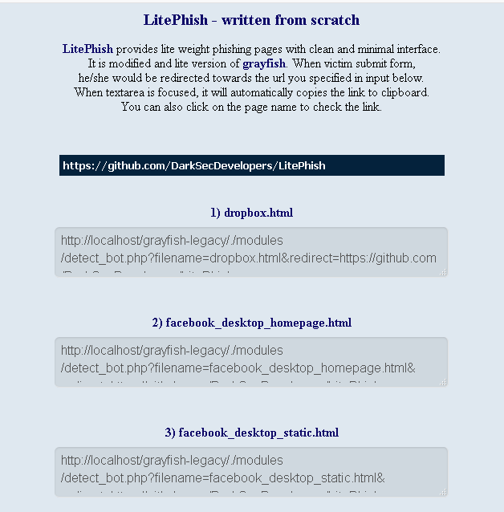

<h1> LitePhish - written from scratch</h1>

<a href=http://github.com/DarkSecDevelopers/LitePhish target=_blank>LitePhish</a> provides lite weight phishing pages with clean and minimal interface.  
It is modified and lite version of <a href=http://www.github.com/graysuit/grayfish target=_blank>grayfish</a>.

<h2> What's new?</h2>
<b>Removed:</b> Base64 encoded image, Embeded html in php. Reason : High filesize and low performance  
<b>Removed:</b> Admin Panel,MetaTags editor, extra things Reason : Unneccessary 
<b>Re-coded:</b> Webpages were recoded. Reason : To acheive fast loadup and low filesize  
<b>Added:</b> Sample.html. Reason : To show mechanism of LitePhish, Helpfull in contribution 
<b>Added:</b> Clicking on textarea will automatically copy URL. Reason : for ease 
<b>Added:</b> Redirection url as parameter to phishing page. Reason : for ease 
<b>Added:</b> Clean and colorfull panel. Reason : for good feelings   
<b>Added:</b> Detect web crawlers by IP. Reason : prevents analysis and link blockage by web crawler bots like googlebot,facebot etc.   
<b>Added:</b> Paypal Webpage   

<h2> Features</h2>
<ul>
<li>Almost, all Templates are under 20KBs that helps in loading webpages fast.</li>
<li>Webpages are completely offline.</li>
<li><del>Images are encoded in base64 to avoid external + internal linking.</del></li>
<li>Codes are highly compressed. Extra codes have been removed.</li>
<li>Login form can't be bypass until all inputs have been filled by a victim.</li>
<li><del>Link with custom preview(image + title + description) when shared on any website.</del></li>
<li><del>Admin login</del> panel has been created for absolute dummies.</li>
<li>Detect bots by their IP & UserAgent and block them to prevent link blockage..</li>
</ul> 

<h2> Usage</h2>
<pre><code>git clone https://github.com/DarkSecDevelopers/LitePhish.git</code></pre>
<ol><li>Upload all files to any web hosting you like</li>
<li>Select any phishing link</li>
<li>Send the link to your victim</li>
<li><b>Note:</b> Username/Password will saved in victims/password.txt</li></ol>

<h2> Available sites</h2>

Click me to view sites

 <ol>
<li>Dropbox</li>
<li>Facebook_desktop_homepage</li>
<li>Facebook_desktop_static</li>
<li>Facebook_mobile + 2FA</li>
<li>Facebook_mobile_fake_security</li>
<li>Github</li>
<li>Garena Free Fire</li>
<li>Instagram</li>
<li>Linkedin</li> 
<li>Microsoft</li>
<li>Netflix</li>
<li>Paypal</li>
<li>Protonmail</li>
<li>Sample (meant for developers)</li>
<li>Snapchat</li>
<li>Tumblr</li>
<li>Messenger</li>
<li>Twitter_desktop</li>
<li>Wordpress</li>
<li>Yahoo</li></ol>

<h2> Contributions</h2>

The reason behind why I re-coded and moved grayfish to organisation was to have project get contributed. You can also contribute by using, reporting etc. You are always welcome so never fear. 
 If you want to add any phishing page then please see sample.html file to see how LitePhish works. 
 Before reporting any bug, verify that it does found on latest release and not listed on <a href="Bugs.md">Bugs.md</a> or <a href="issues">issues</a>.

<h2> Disclaimer</h2>
We assume everyone should use it legally. Author and organisation won't be responsible in case of your crime.

<h2> Contact</h2>
<ul><li>Facebook: <a href="https://fb.com/messages/t/gray.programmerz.5"><b>gray.programmerz.5</b></a></li>
<li>Email: <b><a href="mailto:hackrefisher@gmail.com">hackrefisher@gmail.com</a></b></li>
<li>Website: <a href="https://tiplava.blogspot.com/"><b>tiplava</b></a></li>
<li>Discord: <a href="https://discord.gg/Hu5XPGMTuk"><b>Fishes</b></a></li>
</ul>
<h1>I Love ALLAH + Holy Prophet + Islam and Pakistan.</h1>
